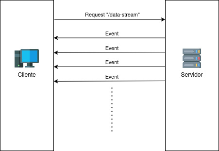

Desenvolvimento feito utilizando Java e Spring Boot.

Para a construção da API considerei a utilização de WebSockets, que permite uma comunicação bi-direcional entre o 
cliente e o servidor, porém como neste caso apenas o servidor precisa enviar informações considerei mais adequado
a utilização de Server-sent events.



A requisição é feita no endpoint `"/data-stream"`, informando o parâmetro `"timeInterval"`, que determina de quanto em 
quanto tempo o servidor irá enviar um novo evento (em milissegundos).

É possível utilizar o `EventSource()` do Javascript para fazer a requisição e então definir o que será executado
toda vez que o servidor enviar um novo evento, como no exemplo:

```javascript
const sse = new EventSource("/data-stream?timeInterval=100");
sse.onmessage = function (e) {
    console.log(e.data);
};
```

## Utilização do protótipo